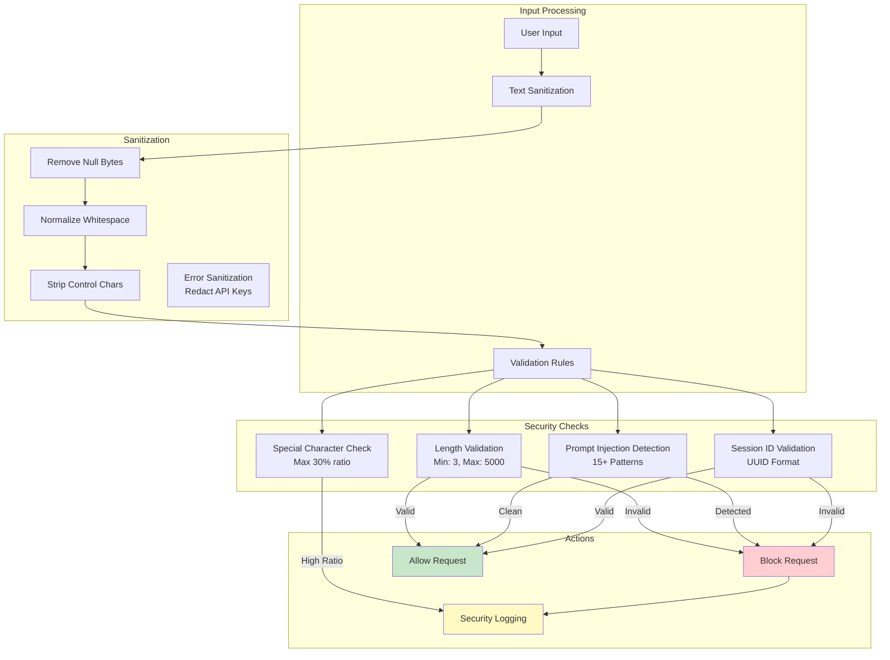

# Assistly

##  1. High-Level System Architecture

```mermaid
graph TB
      subgraph "Client Layer"
          User[👤 User Browser]
          UI[Streamlit UI]
      end

      subgraph "Application Layer"
          Main[main.py<br/>Streamlit App]
          Pipeline[rag_pipeline.py<br/>RAG Engine]
          Classifier[TicketClassifier]
          Memory[ConversationMemoryManager]
      end

      subgraph "Production Features"
          RateLimit[Rate Limiter<br/>Multi-tier]
          Cache[Cache Manager<br/>TTL-based]
          Retry[Retry Logic<br/>Exponential Backoff]
          Metrics[Metrics Collector<br/>Performance Tracking]
          Validator[Input Validator<br/>Security]
      end

      subgraph "External Services"
          OpenAI[OpenAI GPT-4o<br/>Classification & RAG]
          Qdrant[Qdrant Cloud<br/>Vector DB]
          MongoDB[MongoDB Atlas<br/>Document Store]
      end

      subgraph "Data Pipeline"
          Scraper[scrape.py<br/>Firecrawl API]
          Ingestion[qdrant_ingestion.py<br/>Vector Processing]
      end

      User --> UI
      UI --> Main
      Main --> Validator
      Main --> Pipeline
      Main --> Classifier
      Main --> Memory

      Pipeline --> RateLimit
      Pipeline --> Cache
      Pipeline --> Retry
      Pipeline --> Metrics

      RateLimit --> OpenAI
      Pipeline --> Qdrant
      Classifier --> OpenAI

      Scraper --> MongoDB
      MongoDB --> Ingestion
      Ingestion --> Qdrant

      style User fill:#42a5f5,stroke:#0d47a1,stroke-width:2px
      style OpenAI fill:#ffb74d,stroke:#e65100,stroke-width:2px
      style Qdrant fill:#ce93d8,stroke:#6a1b9a,stroke-width:2px
      style MongoDB fill:#81c784,stroke:#2e7d32,stroke-width:2px
```

## 2. RAG Pipeline Flow - Complete Request Lifecycle

##  3. Security & Input Validation Architecture

##  4. Caching Strategy - Multi-Level Architecture

##  5. Rate Limiting System

## 6. Retry Logic & Error Handling

##   7. Memory Management & Conversation Flow

## 8. Metrics Collection & Monitoring

##   9. Data Pipeline - Scraping to Vector Storage

##  10. Classification & Routing Logic

##  11. Settings & Configuration Management

##   12. Connection Pool & Resource Management

```mermaid
graph TB
      subgraph "HTTP Client - OpenAI"
          HTTP[HTTPX Client<br/>Connection Pooling]
          MaxConn[Max Connections: 20]
          KeepAlive[Keep-Alive: 5]
          Timeout[Timeout: 30s]
      end

      subgraph "Qdrant Client"
          GRPC[gRPC Options]
          MaxMsg[Max Message: 100MB]
          KeepAliveQ[Keep-Alive: 30s]
          TimeoutQ[Timeout: 10s]
      end

      subgraph "MongoDB Client"
          Mongo[PyMongo MongoClient]
          AutoPool[Auto Connection Pool<br/>✅ Default: 100 connections]
          ThreadSafe[Thread-Safe<br/>✅ Automatic]
          Reuse[Connection Reuse<br/>✅ Built-in]
      end

      subgraph "Monitoring"
          Track[Connection Tracking]
          Slow[Slow Operation Detection<br/>>5s threshold]
          Errors[Connection Errors<br/>Logging]
          Metrics[Pool Metrics<br/>Utilization/Wait Time]
      end

      HTTP --> MaxConn
      MaxConn --> KeepAlive
      KeepAlive --> Timeout

      GRPC --> MaxMsg
      MaxMsg --> KeepAliveQ
      KeepAliveQ --> TimeoutQ

      Mongo --> AutoPool
      AutoPool --> ThreadSafe
      ThreadSafe --> Reuse

      HTTP --> Track
      GRPC --> Track
      Mongo --> Track

      Track --> Slow
      Track --> Errors
      Track --> Metrics

      style HTTP fill:#e3f2fd
      style GRPC fill:#f3e5f5
      style AutoPool fill:#c8e6c9
      style Metrics fill:#c8e6c9
```

